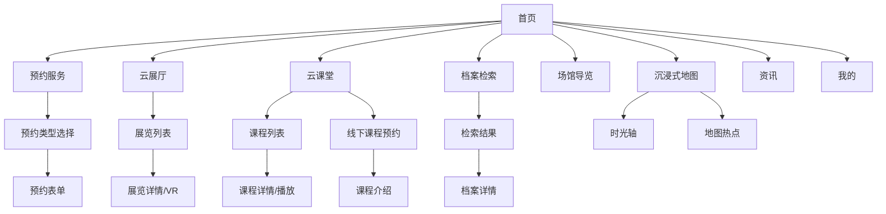

# 深圳市档案馆小程序 - 产品需求说明书 (PRD)

**版本**: 1.2
**最后更新日期**: 2026-01-09
**状态**: 原型开发阶段

---

## 1. 产品概述

### 1.1 项目背景
本项目旨在为深圳市档案馆打造一款移动端数字化服务平台（Web/H5/小程序），通过数字化手段提升档案公共服务能力。平台集成了档案查询、展览参观、党史学习、活动预约等核心功能，致力于让档案文化触手可及。

### 1.2 目标用户
- **普通市民**：查阅民生档案，参观线上展览。
- **党员干部**：参与党史学习教育，预约线下党课。
- **研究人员**：检索历史文献，申请查阅学术档案。
- **学生群体**：参与社会实践活动，了解城市历史。

### 1.3 核心价值
- **服务便捷化**：将线下繁琐的查档、预约流程线上化。
- **文化数字化**：通过VR全景、高清图集等形式展示珍贵馆藏。
- **教育常态化**：提供随时随地的党史学习和思政教育资源。

---

## 2. 信息架构 (IA)

---

## 3. 功能需求详解

### 3.1 首页 (Home)
**页面路径**: `index.html`
- **顶部导航**：显示“深圳市档案馆”Logo及中英文名称。
- **核心操作区**：
  - **预约查档**：红色卡片，快捷入口。
  - **预约展览**：绿色卡片，点击跳转至 `booking-landing.html`。
- **功能导航栏**：
  - **场馆导览**：跳转 `guide.html`。
  - **档案检索**：跳转 `search.html`。
  - **预约课程**：跳转 `course-booking.html`（线下活动预约）。
- **推广横幅**：展示重点活动（如“跟着档案学党史”），点击跳转 `course-booking.html`。
- **特色功能**：
  - **跟着档案观深圳**：跳转 `map-view.html`（数字人文地图）。
  - **逆时追忆**：展示“即将上线”状态。
- **云展厅板块**：
  - 展示精选展览卡片（如“大道同行 海纳百川”）。
  - 右上角“更多”链接跳转 `exhibition-list.html`。
  - 点击卡片跳转 `exhibition-detail.html`。
- **云课堂板块**：
  - 展示推荐课程视频封面。
  - 右上角“更多”链接跳转 `course-list.html`。
  - 点击卡片跳转 `course-list.html`。
- **底部导航**：固定悬浮，切换“首页”、“资讯”、“我的”。

### 3.2 预约服务 (Booking System)
**涉及页面**: `booking-landing.html`, `booking-form.html`, `course-booking.html`

#### 3.2.1 展览预约
- **预约引导页**：提供“个人预约”与“团队预约”大按钮入口。
- **预约表单**：
  - **日期选择**：横向滚动的周日历组件，显示日期及状态。
  - **展览选择**：网格布局展示可选展览（如“常设展”、“特展”）。
  - **时段选择**：上午/下午时间段按钮。
  - **提交交互**：点击“确认预约”后，弹出自定义模态框提示“请先进行实名认证”（含遮罩层、自定义样式）。

#### 3.2.2 课程/活动预约
- **分类切换**：顶部 Tab 栏切换“预约党课”、“预约思政课”、“活动招募”。
- **列表展示**：
  - 卡片式布局，展示活动封面、标题。
  - 特殊标签：“可送课上门”（金色角标）。
  - 点击卡片进入详情页。

### 3.3 云展厅 (Virtual Exhibition)
**涉及页面**: `exhibition-list.html`, `exhibition-detail.html`

- **展览列表**：
  - 垂直流式布局，展示展览海报大图、标题、简介。
- **展览详情 (VR 模式)**：
  - **全景背景**：全屏展示展厅内部高清全景图，模拟沉浸感。
  - **悬浮 UI**：
    - 顶部：透明导航栏，返回按钮。
    - 中部：展览大标题（艺术字体）。
    - 右侧：功能工具栏（全屏、VR模式、指南针）。
    - 底部：场景切换缩略图栏（场馆、第一单元、第二单元等），支持横向滚动切换场景。
    - 交互：屏幕中央显示向上导航箭头（模拟街景前进）。

### 3.4 云课堂 (Online Courses)
**涉及页面**: `course-list.html`, `course-detail.html`

- **课程列表**：
  - 垂直列表，展示视频课程卡片。
  - 元素：视频封面图、居中播放按钮图标、课程分类标签、课程标题。
- **课程详情**：
  - 顶部大图/视频占位。
  - 课程元数据：标题、时长、有效期。
  - 课程介绍：富文本详细描述。
  - **底部操作**：悬浮“立即预约”按钮，点击弹出提示框“线上暂未开通，请联系oceansHan”。

### 3.5 档案检索 (Archive Search)
**涉及页面**: `search.html`, `search-result.html` (待完善), `archive-detail.html` (待完善)

- **检索首页**：
  - 搜索输入框（支持清除内容）。
  - 档案馆筛选：网格展示各区档案馆快捷入口（选中高亮）。
  - 底部悬浮“搜索”按钮。

### 3.6 场馆导览 (Venue Guide)
**涉及页面**: `guide.html`

- **楼层地图**：展示馆内平面图。
- **楼层切换**：底部按钮切换 B1-3F。
- **设施筛选**：顶部 Tab 筛选服务设施（洗手间、电梯等）。

### 3.7 数字人文地图 (Map View)
**涉及页面**: `map-view.html`

- **全屏地图**：展示深圳市地图底图。
- **时间轴**：顶部横向时间轴，切换不同历史时期。
- **POI 交互**：地图上散布档案热点（Pin），点击显示档案简要信息气泡。

---

## 4. 非功能需求 (NFR)

### 4.1 UI/UX 规范
- **色彩体系**：
  - **主色 (Gold)**: `#C5A065` (用于标题、图标、高亮)
  - **辅色 (Red)**: `#A83226` (用于重要按钮、党建主题)
  - **背景色**: `#F9F5EB` (米色纹理，营造历史感)
- **字体**：
  - 标题使用宋体/楷体 (`KaiTi`, `STKaiti`) 增强文化属性。
  - 正文使用无衬线字体 (`sans-serif`) 确保易读性。
- **交互体验**：
  - 强调“沉浸式”体验，多用全屏背景、半透明遮罩。
  - 按钮点击区域适中，符合移动端操作习惯。
  - 页面切换流畅，无明显卡顿。

### 4.2 兼容性
- 适配主流移动端浏览器分辨率（375px - 414px 宽度基准）。
- 关键功能（如 VR、视频）需考虑低端机型降级处理。

---

## 5. 未来规划 (Roadmap)

### 5.1 VR 全景深化
- 接入真实的 WebGL/Three.js 引擎，实现真正的 360 度全景漫游。
- 支持陀螺仪控制视角。

### 5.2 用户体系完善
- 实现真实的微信登录/手机号注册。
- 完善“我的预约”和“借阅历史”数据同步。

### 5.3 智能检索
- 引入 OCR 技术，支持图片检索档案。
- 增加知识图谱关联推荐。
