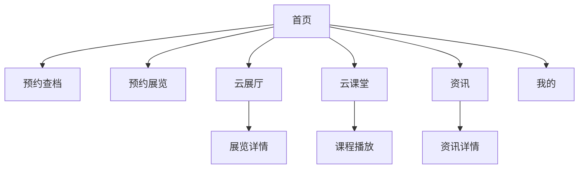

## 1. 产品概述
深圳市档案馆微信小程序，为用户提供档案查询、展览预约、在线学习等一站式文化服务。让市民能够便捷地接触历史文化，预约参观展览，参与党史学习。
- 目标用户：对历史文化感兴趣的市民、研究人员、学生群体
- 市场价值：数字化文化传播，提升公共文化服务可及性

## 2. 核心功能

### 2.2 功能模块
小程序主要包含以下页面：
1. **首页**：档案馆品牌展示、预约服务入口、功能导航、推广活动
2. **云展厅**：虚拟展览列表、展览详情、在线观展
3. **云课堂**：在线课程列表、课程详情、视频播放
4. **资讯页**：新闻资讯列表、详情阅读
5. **我的**：个人中心、预约记录、学习记录
6. **沉浸式导览**：时光地图、瀑布流浏览、AR互动

### 2.3 页面详情
| 页面名称 | 模块名称 | 功能描述 |
|---------|---------|---------|
| 首页 | 顶部导航栏 | 显示状态图标、档案馆Logo和中英文名称 |
21→| 首页 | 预约服务卡片 | 预约查档和预约展览两个入口，点击跳转对应预约页面 |
22→| 预约展览 | 预约类型 | 个人预约与团队预约入口，展示档案馆Logo与名称。 |
23→| 预约展览 | 预约表单 | 日历选择日期，展览列表选择，时间段选择，确认预约。 |
24→| 首页 | 功能导航区 | 场馆导览、档案检索、预约课程三个功能入口 |
| 首页 | 推广横幅 | 党史学习活动宣传，立即预约按钮跳转活动详情 |
| 首页 | 特色功能区 | “跟着档案观深圳”入口，点击进入沉浸式地图页面。 |
| 首页 | 底部导航栏 | 首页、资讯、我的三个主tab切换 |
| 沉浸式导览 | 时光地图 | 全屏地图展示，顶部时间轴切换年份，地图热点交互，底部沉浸式导航。 |
| 沉浸式导览 | 档案瀑布流 | 双列瀑布流展示档案图片，点击查看大图（Lightbox），支持手势关闭。 |
| 云展厅 | 展厅列表 | 显示展览海报、标题、简介，点击进详情 |
| 云课堂 | 课程列表 | 显示课程封面、标题、播放图标，点击播放视频 |
| 资讯 | 资讯列表 | 显示新闻标题、摘要、发布时间 |
| 我的 | 个人信息 | 顶部红色渐变背景，显示头像、注册/登录、阅览证、客服入口。 |
| 我的 | 功能列表 | 白色圆角卡片列表，包含：个人信息、我的预约、我的打印申请、首次到馆注册申请表。 |

## 3. 核心流程
用户打开小程序后，首先进入首页。首页提供档案服务的核心入口：
- 点击预约查档或预约展览卡片，进入预约流程
- 点击功能导航图标，进入对应服务页面
- 点击推广横幅，查看党史学习活动详情
- 通过底部导航切换不同功能模块

## 4. 用户界面设计

### 4.1 设计风格
- **主色调**：金色(#D4A017)、红色(#DC2626)、青绿色(#059669)、米色(#F5F5DC)
- **按钮样式**：圆角矩形，内阴影效果，文字居中
- **字体**：中文使用思源黑体，英文使用Arial，标题加粗显示
- **布局风格**：卡片式布局，垂直堆叠，圆角容器分隔
- **沉浸式风格**：全屏背景图，半透明蒙层，悬浮操作控件（适用于地图、瀑布流）
- **图标风格**：线性图标，白色填充，简洁现代

### 4.2 页面设计概述
| 页面名称 | 模块名称 | UI元素 |
|---------|---------|--------|
| 首页 | 顶部导航 | 浅米色背景，金色档案馆Logo，中英文名称垂直排列 |
| 首页 | 预约卡片 | 红绿渐变背景，白色图标和文字，圆角矩形，并排布局 |
| 首页 | 功能导航 | 金色圆角容器，三列网格布局，白色图标配中英文标签 |
| 首页 | 推广横幅 | 红色渐变背景，白色毛笔字体标题，立即预约白色按钮 |
| 首页 | 特色功能 | 图文卡片，圆角设计，背景图案或模糊照片效果 |
| 云展厅 | 展厅列表 | 横向海报卡片，毛笔字体标题，展览类型标签 |
| 场馆导览 | 导览首页 | 显示场馆地图（图片），支持楼层切换（B1-3F），顶部提供服务设施分类筛选（服务台、卫生间、展览、电梯）。 |
| 档案检索 | 检索首页 | 顶部搜索框，中部展示深圳市及各区档案馆选择列表（如福田、罗湖、南山等），底部固定搜索按钮。背景包含浅色纹理。 |
| 档案检索 | 检索结果页 | 显示搜索结果统计（如“找到约299条结果”）。支持结果中二次搜索。结果列表分页展示，每页显示若干条。每条记录包含：档号（支持复制）、标题（关键词高亮）、起始/终止日期、载体数量、档案存址。 |
| 档案检索 | 档案详情页 | 展示档案完整元数据（档号、标题、责任者、日期、保管期限、密级等）。核心区域为PDF文件预览（支持手势缩放、翻页）。底部提供“收藏”和“申请查阅”操作按钮。 |
| 资讯 | 资讯列表 | 白色圆角卡片，上图下文布局，阴影效果，标题文字加粗 |

### 4.3 响应式设计
- 采用微信小程序原生适配方案
- 基于rpx单位实现屏幕自适应
- 支持iOS和Android双平台
- 优化触摸交互体验，按钮点击区域不小于88rpx