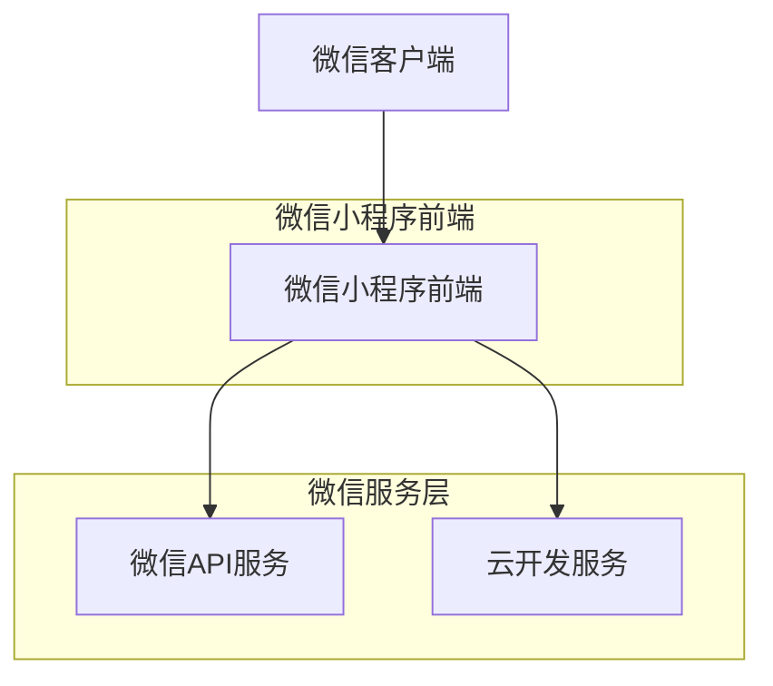
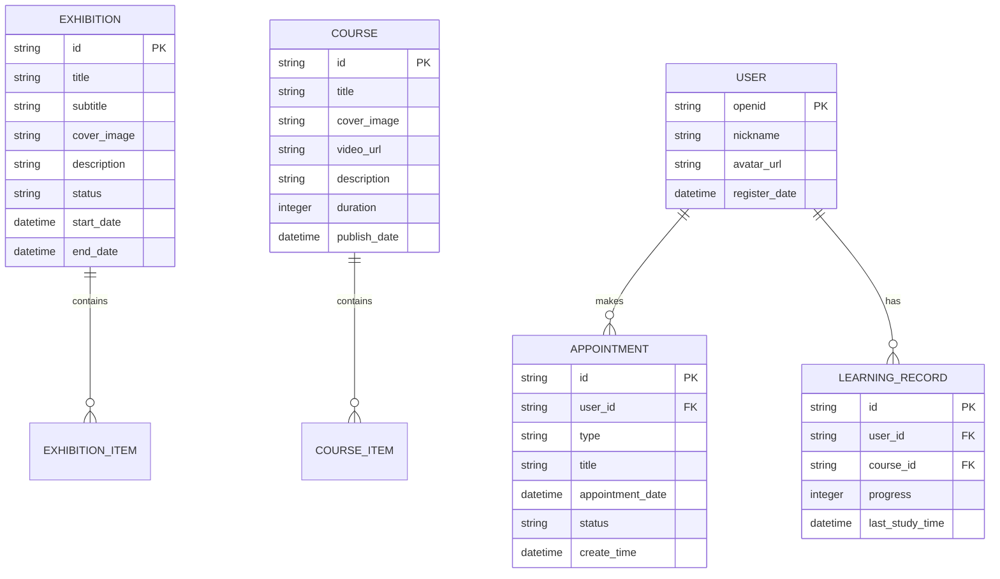

## 1. 架构设计



## 2. 技术描述

- **前端框架**: 微信小程序原生框架 + WXML + WXSS + JavaScript
- **初始化工具**: 微信开发者工具
- **后端服务**: 微信云开发 (CloudBase)
- **数据库**: 云开发数据库 (类似MongoDB)
- **文件存储**: 云开发存储
- **用户认证**: 微信登录授权

## 3. 路由定义

| 页面路径 | 用途 |
|---------|------|
| /pages/index/index | 首页，展示核心功能入口和推广内容 |
| /pages/exhibition/exhibition | 云展厅页面，展示虚拟展览列表 |
| /pages/course/course | 云课堂页面，展示在线课程列表 |
| /pages/news/news | 资讯页面，展示新闻资讯列表 |
| /pages/profile/profile | 个人中心，用户信息和记录管理 |
| /pages/appointment/appointment | 预约页面，档案查询和展览预约 |
| /pages/search/search | 档案检索页面，搜索档案资料 |

## 4. 数据模型

### 4.1 数据模型定义



### 4.2 数据定义语言

展览表 (exhibitions)
```javascript
// 云开发数据库集合定义
{
  _id: string,           // 主键ID
  title: string,         // 展览标题
  subtitle: string,      // 副标题
  coverImage: string,     // 封面图片URL
  description: string,    // 展览描述
  status: string,        // 状态：online/offline
  startDate: Date,       // 开始日期
  endDate: Date,         // 结束日期
  createTime: Date,      // 创建时间
  updateTime: Date       // 更新时间
}
```

课程表 (courses)
```javascript
{
  _id: string,           // 主键ID
  title: string,         // 课程标题
  coverImage: string,    // 封面图片URL
  videoUrl: string,      // 视频URL
  description: string,   // 课程描述
  duration: number,      // 时长(分钟)
  publishDate: Date,    // 发布日期
  viewCount: number,    // 观看次数
  createTime: Date      // 创建时间
}
```

用户表 (users)
```javascript
{
  _openid: string,       // 微信用户唯一标识
  nickName: string,      // 用户昵称
  avatarUrl: string,     // 头像URL
  gender: number,        // 性别
  city: string,         // 城市
  province: string,     // 省份
  registerDate: Date,   // 注册时间
  lastLoginDate: Date   // 最后登录时间
}
```

预约记录表 (appointments)
```javascript
{
  _id: string,           // 主键ID
  _openid: string,       // 用户ID
  type: string,         // 预约类型：archive/exhibition
  title: string,        // 预约标题
  appointmentDate: Date, // 预约日期
  status: string,       // 状态：pending/confirmed/completed/cancelled
  contactInfo: object,  // 联系信息
  createTime: Date,     // 创建时间
  updateTime: Date     // 更新时间
}
```

学习记录表 (learningRecords)
```javascript
{
  _id: string,          // 主键ID
  _openid: string,      // 用户ID
  courseId: string,     // 课程ID
  progress: number,     // 学习进度(0-100)
  lastStudyTime: Date,  // 最后学习时间
  totalStudyTime: number, // 总学习时长(秒)
  createTime: Date,    // 创建时间
  updateTime: Date     // 更新时间
}
```