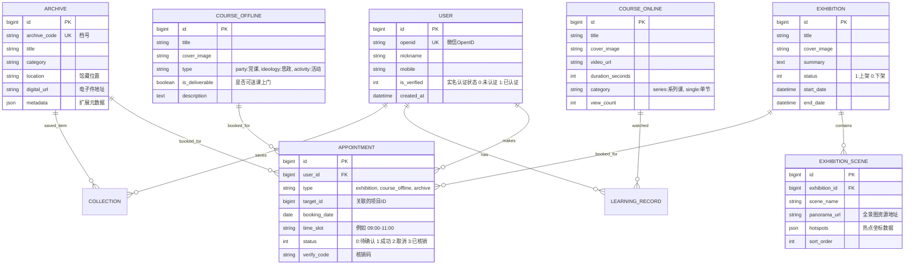

# 深圳市档案馆小程序 - 数据库设计文档

**版本**: 1.0
**日期**: 2026-01-09
**状态**: 初始设计

---

## 1. 设计概述

本数据库设计旨在支持深圳市档案馆小程序的各项核心业务，包括用户管理、档案检索、展览预约、课程学习及云展厅浏览。设计遵循第三范式（3NF），同时针对移动端查询性能进行了适当的反范式优化（如冗余部分字段）。

**数据库选型建议**: 
- **关系型数据库**: MySQL 8.0 (适用于核心业务数据、订单、预约)
- **非关系型数据库**: MongoDB / Redis (适用于日志、缓存、VR热点数据、非结构化档案元数据)

---

## 2. 实体关系图 (ER Diagram)

---

## 3. 数据表详细定义

### 3.1 用户模块

#### `t_user` (用户表)
| 字段名 | 类型 | 长度 | 必填 | 说明 |
| :--- | :--- | :--- | :--- | :--- |
| id | BIGINT | 20 | Y | 主键，自增 |
| openid | VARCHAR | 64 | Y | 微信OpenID，唯一索引 |
| unionid | VARCHAR | 64 | N | 微信UnionID |
| nickname | VARCHAR | 64 | N | 昵称 |
| avatar_url | VARCHAR | 255 | N | 头像地址 |
| mobile | VARCHAR | 20 | N | 手机号 (加密存储) |
| real_name | VARCHAR | 50 | N | 真实姓名 |
| id_card | VARCHAR | 100 | N | 身份证号 (加密存储) |
| is_verified | TINYINT | 1 | Y | 实名状态: 0-未认证, 1-已认证 |
| create_time | DATETIME | - | Y | 注册时间 |
| update_time | DATETIME | - | Y | 更新时间 |

### 3.2 展览模块

#### `t_exhibition` (展览主表)
| 字段名 | 类型 | 长度 | 必填 | 说明 |
| :--- | :--- | :--- | :--- | :--- |
| id | BIGINT | 20 | Y | 主键 |
| title | VARCHAR | 100 | Y | 展览标题 |
| cover_image | VARCHAR | 255 | Y | 封面图URL |
| summary | VARCHAR | 500 | N | 展览简介 |
| content | TEXT | - | N | 展览详情(富文本) |
| type | VARCHAR | 20 | Y | 类型: virtual(云展), physical(线下) |
| status | TINYINT | 1 | Y | 状态: 1-发布, 0-草稿 |
| view_count | INT | 11 | N | 浏览量 |
| sort_order | INT | 11 | N | 排序权重 |

#### `t_exhibition_scene` (VR场景表)
| 字段名 | 类型 | 长度 | 必填 | 说明 |
| :--- | :--- | :--- | :--- | :--- |
| id | BIGINT | 20 | Y | 主键 |
| exhibition_id | BIGINT | 20 | Y | 关联展览ID |
| name | VARCHAR | 50 | Y | 场景名称 (如: 入口, 第一单元) |
| thumb_url | VARCHAR | 255 | Y | 缩略图URL (底部导航用) |
| panorama_url | VARCHAR | 255 | Y | 全景图资源URL |
| initial_view | JSON | - | N | 初始视角参数 {yaw, pitch, hfov} |
| hotspots | JSON | - | N | 热点数据数组 [{pitch, yaw, text, next_scene_id}] |
| sort_order | INT | 11 | N | 排序 |

### 3.3 课程模块

#### `t_course_online` (线上云课堂)
| 字段名 | 类型 | 长度 | 必填 | 说明 |
| :--- | :--- | :--- | :--- | :--- |
| id | BIGINT | 20 | Y | 主键 |
| title | VARCHAR | 100 | Y | 课程标题 |
| subtitle | VARCHAR | 200 | N | 副标题 |
| cover_image | VARCHAR | 255 | Y | 封面图 |
| video_url | VARCHAR | 500 | Y | 视频流地址 |
| duration | INT | 11 | N | 时长(秒) |
| publish_date | DATE | - | Y | 发布日期 |
| tags | VARCHAR | 255 | N | 标签 (逗号分隔) |

#### `t_course_offline` (线下预约课程)
| 字段名 | 类型 | 长度 | 必填 | 说明 |
| :--- | :--- | :--- | :--- | :--- |
| id | BIGINT | 20 | Y | 主键 |
| title | VARCHAR | 100 | Y | 课程/活动标题 |
| cover_image | VARCHAR | 255 | Y | 封面图 |
| category | VARCHAR | 20 | Y | 分类: party(党课), ideology(思政), activity(招募) |
| is_deliverable | TINYINT | 1 | Y | 是否送课上门: 1-是, 0-否 |
| detail_html | TEXT | - | N | 详情页富文本 |
| min_group_size | INT | 11 | N | 最小团体人数 |

### 3.4 预约模块

#### `t_appointment` (预约记录表)
| 字段名 | 类型 | 长度 | 必填 | 说明 |
| :--- | :--- | :--- | :--- | :--- |
| id | BIGINT | 20 | Y | 主键 |
| booking_no | VARCHAR | 32 | Y | 预约单号(唯一) |
| user_id | BIGINT | 20 | Y | 用户ID |
| biz_type | VARCHAR | 20 | Y | 业务类型: exhibition, course, archive |
| biz_id | BIGINT | 20 | Y | 关联业务ID (展览ID/课程ID) |
| booking_date | DATE | - | Y | 预约日期 |
| time_slot | VARCHAR | 20 | Y | 时间段 (09:00-10:00) |
| visitor_count | INT | 11 | Y | 参观人数 |
| contact_name | VARCHAR | 50 | Y | 联系人 |
| contact_phone | VARCHAR | 20 | Y | 联系电话 |
| status | TINYINT | 1 | Y | 状态: 0-待核销, 1-已完成, 2-已取消, 3-过期 |
| qr_code | VARCHAR | 255 | N | 核销二维码地址 |
| checkin_time | DATETIME | - | N | 核销时间 |

### 3.5 档案与资讯

#### `t_archive` (档案信息表)
| 字段名 | 类型 | 长度 | 必填 | 说明 |
| :--- | :--- | :--- | :--- | :--- |
| id | BIGINT | 20 | Y | 主键 |
| archive_code | VARCHAR | 50 | Y | 档号 (唯一索引) |
| title | VARCHAR | 255 | Y | 题名 |
| content_desc | TEXT | - | N | 内容摘要 |
| category_id | INT | 11 | N | 全宗号/分类ID |
| year | VARCHAR | 10 | N | 年份 |
| location_ref | VARCHAR | 100 | N | 馆藏位置索引 |
| pdf_url | VARCHAR | 255 | N | 数字化副本地址 |
| is_open | TINYINT | 1 | Y | 开放状态: 1-开放, 0-控制 |

#### `t_news` (资讯表)
| 字段名 | 类型 | 长度 | 必填 | 说明 |
| :--- | :--- | :--- | :--- | :--- |
| id | BIGINT | 20 | Y | 主键 |
| title | VARCHAR | 100 | Y | 标题 |
| cover_image | VARCHAR | 255 | N | 列表图 |
| summary | VARCHAR | 200 | N | 摘要 |
| content | LONGTEXT | - | Y | 正文内容 |
| publish_time | DATETIME | - | Y | 发布时间 |
